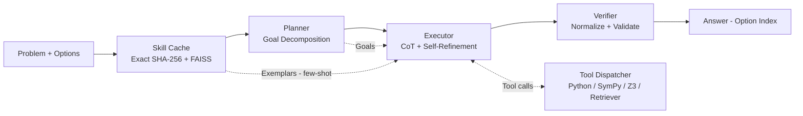
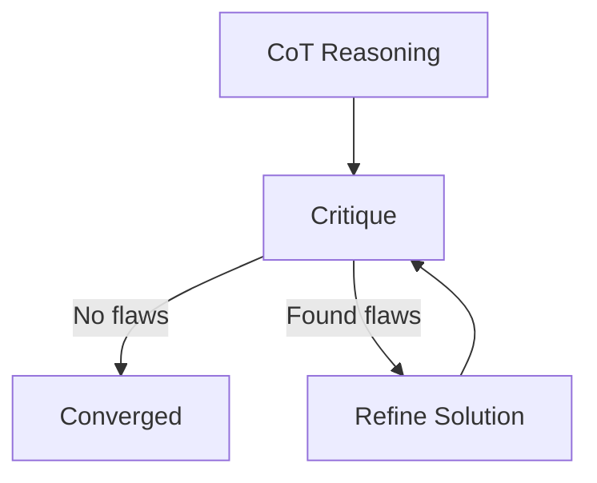

# ETHOS — Self‑Refinement Agentic Reasoner

<p align="center">
  <strong>Agentic AI framework</strong> for multi‑domain reasoning (logic puzzles, spatial reasoning, math, riddles) with
  <strong>hybrid retrieval</strong>, <strong>planning</strong>, <strong>tool use</strong>, <strong>self‑refinement</strong>, and <strong>verification</strong>.
</p>

<p align="center">
  <a href="https://github.com/CIPHERclux/Ethos-Agentic-Reasoner"></a>
  
  
  
  
</p>

---

## Why ETHOS?

ETHOS is designed to be **robust under uncertainty**: it doesn’t just “answer once”—it can **critique itself** and **revise**.
It also learns from prior work via a **skill cache** (exact match + semantic retrieval), and validates outputs with a **verifier**.

---

## Results (Phi‑3.5 in this architecture)

A 96‑question evaluation (see `phi35_reasoning_analysis.html`) shows:

- **Overall accuracy:** **67.7%** (**65 / 96** correct)
- **Lift vs baseline Phi‑3.5 (~52%):** **+15.7 percentage points**
- **Relative improvement:** **+30.2%**
- **Avg reasoning steps:** **3.2** steps/solution

**Strengths by category** (accuracy):
- Logical traps: **100%** (3/3)
- Optimization & planning: **76.2%** (16/21)
- Classic riddles: **75.0%** (6/8)

**Main weakness areas** to target next:
- Spatial reasoning: **58.3%** (14/24)
- Recurring failure modes: geometric miscounting, gear ratio inversion, repeated sequence mistakes

---

## Architecture (at a glance)



### Self‑refinement loop



---

## Repo structure

```text
.
├─ ethos.ipynb
├─ src/
│  ├─ agent/        # planner, executor, llm client, schemas
│  ├─ tools/        # python/sympy/z3/retriever/choice selector
│  ├─ skill_cache/  # faiss + sqlite index/store
│  ├─ verifier/     # validation + constraint parsing
│  ├─ inference/    # batch runs + csv formatting
│  └─ evals/        # scoring + sanity checks
├─ data/
│  ├─ train.csv
│  └─ test.csv
├─ cache/
│  ├─ faiss/
│  └─ sqlite/
├─ requirements.txt
└─ pyproject.toml
```

---

## Core components

### 1) Skill Cache (Long‑Term Memory)
- **Dual‑mode retrieval**: SHA‑256 exact matching + FAISS semantic search
- **SQLite** for metadata
- Embeddings (SentenceTransformer)
- Designed for fast reuse: **exact lookup** first, semantic fallback second

### 2) Planner (Goal decomposition)
- Generates up to a few short sub‑goals
- Can inject retrieved exemplars as few‑shot context
- Uses **JSON schema** to constrain outputs

### 3) Executor (Self‑refinement engine)
- Produces an initial solution via **stepwise reasoning**
- Runs **critique → refine** loop (bounded iterations)
- Can fall back to a standard **ReAct** tool loop if needed

### 4) Tool Dispatcher (computational backend)
Supports pluggable tools:
- **python** (safe fallback for basic arithmetic)
- **sympy** (symbolic math)
- **z3** (constraint solving)
- **retriever** (when configured)
- **choice_selector** (maps computed answers back to an MCQ option)

### 5) Verifier (answer validation)
- Normalizes candidate answers
- Validates and converts to an option index when possible

---

## Installation

### Option A — pip
```bash
pip install -r requirements.txt
```

### Option B — project install
```bash
pip install .
```

**Python:** 3.9+ (declared in `pyproject.toml`).

---

## Quickstart

### 1) Notebook (recommended)
Open and run:
- `ethos.ipynb`

### 2) Batch inference
Entry point:
- `src/inference/run_batch.py`

Output formatting helper:
- `src/inference/format_output_csv.py`

---

## Example outputs (illustrative)

### Example: MCQ prediction payload (typical shape)
```json
{
  "selected_option": 3,
  "solution_text": {
    "answer": "Option 3",
    "reasoning_steps": [
      "Step 1: Parse the question and constraints.",
      "Step 2: Use a tool - Python/SymPy/Z3 - if needed.",
      "Step 3: Verify and normalize to an option index."
    ],
    "confidence": "medium"
  },
  "audit_trail": [
    "retrieved_similar_top_sim=0.83",
    "goals_emitted:4",
    "cot_initial",
    "critique_iter_1_flaws_1",
    "refined_iter_1",
    "cot_steps_verified",
    "refinement_answer_extracted"
  ]
}
```

### Example: pipeline view
```text
Problem + Options
  → Skill Cache (exact / semantic)
  → Planner (goals)
  → Executor (CoT → critique → refine)
  → Verifier (normalize)
  → Final option index
```

---

## License

MIT (declared in `pyproject.toml`).
